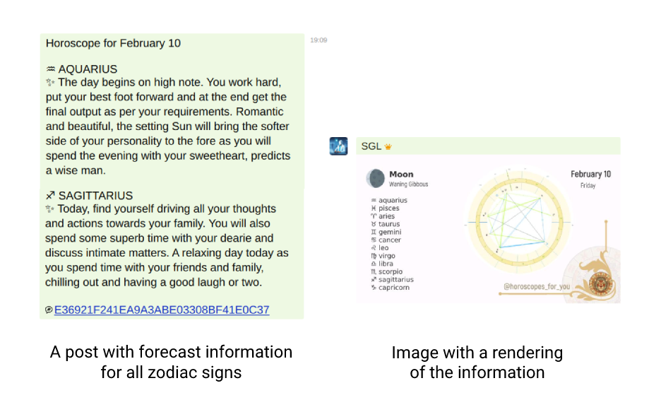

:waxing_crescent_moon: An example of WEB 3.0 horoscope bot

## :zap: Configuring the bot

1. [Download a ready-made release](releases) or build a bot from source.
2. [Create API key](https://rapidapi.com/Alejandro99aru/api/horoscope-astrology).
3. Fill in the data in the settings file: `config.json`

About fields in the config:
* `apikey` - API key that you received from rapidapi;
* `channelID` - channel ID in Utopia;
* `timeVariant` - Horoscope query type by time: `today`, `yesterday`, `tomorrow`, `week`, `month`, `year`;
* `wordReplace` - is used to replace the words in the received answer;
* `utopia` - Utopia client connection settings.

How to get parameters to connect to the Utopia API can be found [in this documentation](https://udocs.gitbook.io/utopia-api/utopia-api/how-to-enable-api-access).

### How to run a bot

When you run the bot, the post will be placed in the channel. So you can schedule the bot to run every day, for example, to post daily horoscopes to the channel.

You can use the Cron startup.

You can choose an interval of "a month" and post not only to the channel, but also to the chat room.

## :gear: Build from sources

```bash
git clone https://github.com/Sagleft/utopia-zodiac
go build
```

## :eyes: Useful Links

[A topic about a bot in the forum](https://talk.u.is/viewtopic.php?id=361).

Looking for examples of projects for Utopia API? [Check out this documentation](https://udocs.gitbook.io/utopia-api/examples-of-projects).

---
[](https://udocs.gitbook.io/utopia-api/)
